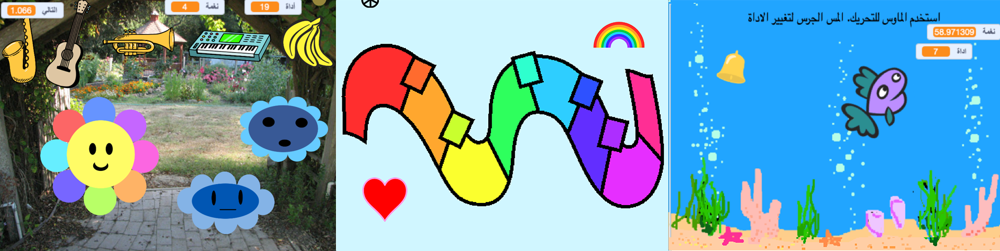
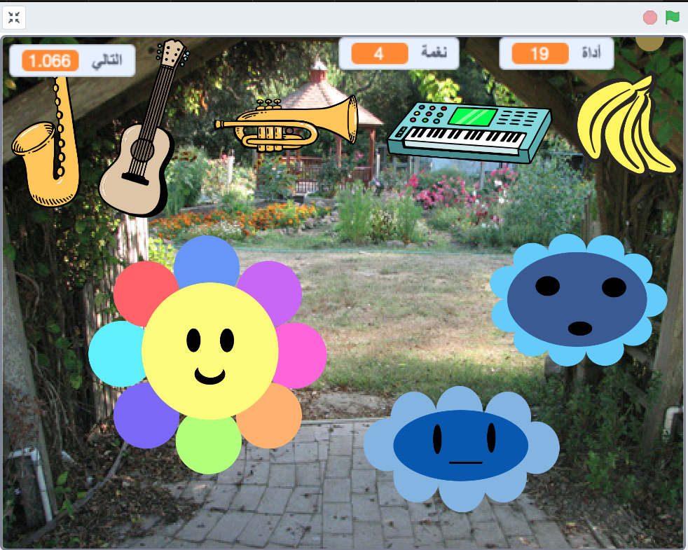
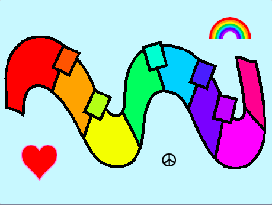
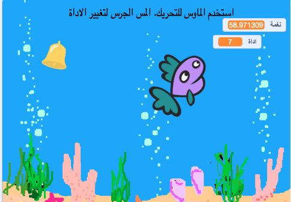

## سوف تصنع

صمم صانع الموسيقى الرقمية الخاص بك! اخترع آلة موسيقية افتراضية وجرب الأصوات والألوان وغير ذلك.

** الموسيقى الرقمية ** هي موسيقى مصنوعة من أرقام باستخدام أجهزة الكمبيوتر. الموسيقى الرقمية موجودة في كل مكان - كم مرة تشعر فيها بالموسيقى القادمة من الهاتف أو الكمبيوتر أو التلفزيون؟

سوف تفعلها:
+ صمم آلة موسيقية افتراضية خاصة بك
+ تخصيص تفاعل المستخدم مع الموسيقى
+ اكتشف العلاقة بين الرياضيات والموسيقى

--- no-print ---

### تشغيل ▶️

--- task ---

  
تتحرك مع موشرك (أو بإصبعك إذا كنت تستخدم جهازًا لوحيًا) ، فوق أجزاء مختلفة من الزهرة. ماذا تستطيع ان تسمع؟ حاول تغيير الصوت من خلال النقر على الآلات في الجزء العلوي.

  <iframe allowtransparency="true" width="485" height="402" src="" frameborder="0"></iframe>

--- /task ---

### احصل على أفكار 💭

سوف تتخذ بعض قرارات لتصميم وإنشاء أداتك الموسيقية الخاصة ، وتحديد كيفية تفاعلها وشكلها.

--- task ---

استكشف هذه المشاريع النموذجية للحصول على مزيد من الأفكار:

  <iframe allowtransparency="true" width="485" height="402" src="" frameborder="0"></iframe>

  <iframe allowtransparency="true" width="485" height="402" src="" frameborder="0"></iframe>

  <iframe allowtransparency="true" width="485" height="402" src="" frameborder="0"></iframe>

--- print-only ---

### احصل على أفكار 💭

سوف تتخذ بعض قرارات لتصميم وإنشاء أداتك الموسيقية الخاصة ، وتحديد كيفية تفاعلها وشكلها. انظر داخل أمثلة المشاريع أدناه للإلهام.

 سكراتش 1: زهور موسيقية - أمثلة: https://scratch.mit.edu/studios/520146902/ Scratch studio.

 Scratch 1: لوحة مفاتيح رائعة - أمثلة: https://scratch.mit.edu/studios/546067020 Scratch studio.

 سكراتش 1: سمكة موسيقية - أمثلة: https://scratch.mit.edu/studios/106040821/ Scratch studio.

--- /print-only ---
