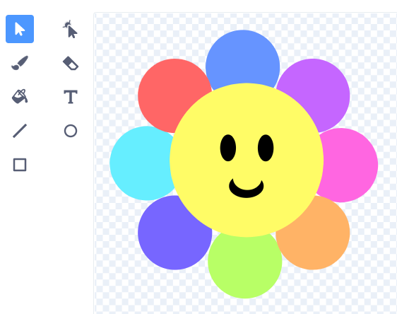
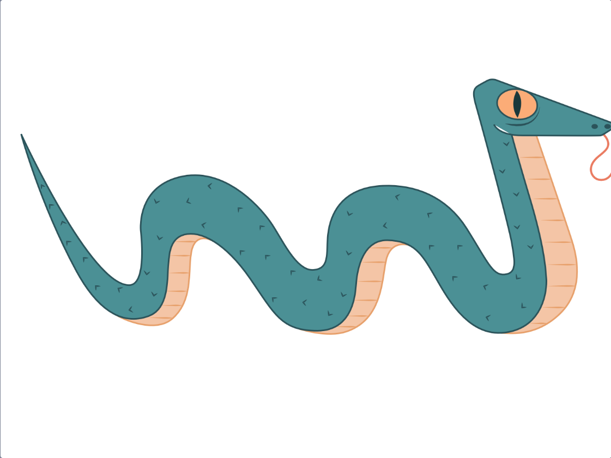

## قم بإنشاء أداة موسيقية

ستنشئ كائنًا جديدًا يقوم بتشغيل الأصوات بناءً على المكان الذي يضع فيه المستخدم مؤشر الماوس أو يتفاعل مع المشهد.

 <video width="320" height="240" controls>
  <source src="images/step-2-demo.mp4" type="video/mp4">
  متصفحك لا يدعم فيديو mp4.
</video> 

--- task ---

افتح [مشروع Scratch جديد](http://rpf.io/scratch-new){:target="_blank"}. سيتم فتح Scratch في علامة تبويب متصفح أخرى.

[[[working-offline]]]

--- /task ---

كائن **آلة موسيقية**الخاصة بك سوف يشغل نغمات مختلفة ، اعتمادًا على الألوان التي يتكون منها كائن الآلة  الموسيقية. سوف تحتاج إلى اختيار شكل آلتك الموسيقية. هل تريد أن تبدو آلتك الموسيقية وكأنها آلة موسيقية تقليدية أو شيء تراه في منزلك أو خارجه؟

--- task ---

**اختر:** كيف سيبدو كائن **آلتك الموسيقية**؟ استخدم أداة **الرسام** لإنشائه. في المثال أدناه ، تبدو الآلة الموسيقية وكأنها زهرة.

فكر في عدد الأصوات المختلفة التي تريد أن تعزفها آلتك الموسيقية. تأكد من أن آلتك الموسيقية تحتوي على الأقل مجموعة من الألوان المختلفة.

--- /task ---

--- task ---

أنشئ كائن **آلتك الموسيقية**.

هل تريد أن:
- أضف كائنًا من مكتبة الكائنات?
- هل أخترت كائنًا من مكتبة الكائنات لصنع شيء جديد؟
- تحميل كائن؟
- ترسم كائن خاص بك؟

--- collapse ---
---
title: تهيئة الكائنات
---

تم تهيئة لوحة المفاتيح الرائعة هذه من الكائن **Snake**:

لتهئية الكائنات ، أختر الكائن الذي تريده وانتقل إلى محرر الرسم.

إذا كنت تريد فقط جزءًا من الكائن ، فيمكنك قصه.

إذا كنت تريد فقط الحدود الخارجية للكائن ، فحوله إلى صورة نقطية واستخدم أداة **Fill**.

--- /collapse ---

[[[generic-scratch3-draw-sprite]]]

--- collapse ---
---
title: البحث عن الصور التي يمكنك استخدامها
---

الشركة أو الشخص الذي يقوم بإنشاء صورة ، سواء باستخدام برامج الرسوم أو الكاميرا ،يمتلكون حقوق تلك الصورة. هذا يعني أنه لا يمكنك استخدام الصورة دون طلب إذنهم أولاً.

أحيانًا يكون للصور ترخيص لا يسمح باستخدامها دون طلب الإذن أولاً. تسمح لك محركات البحث مثل Google بالبحث عن هذه الأنواع من الصور.

ستتطلب منك معظم هذه الصور **أن تنسب** إلى المنشئ. لذلك يجب عليك إضافة رابط موقع الويب الذي وجدتهم فيه ؛ يمكنك إضافة هذا إلى قسم **الملاحظات والاعتمادات** من صفحة مشروعك.

--- /collapse ---

[[[generic-get-picture-from-web]]]

--- collapse ---
---
title: تحميل كائن إلى Scratch
---

- اضغط على قائمة **اختيار كائن** وأختر ،**تحميل كائن**.

- استخدم متصفح الملفات الخاص بك لتحديد الكائن الذي ترغب في تحميله.

--- /collapse ---

--- /task ---

--- task ---

**التصحيح:** ربما تكون قد أجريت الكثير من تصحيح الأخطاء بالفعل! هل قمت بتغيير الاتجاه الذي كان يشير إليه كائنك؟ هل قمت بحل أي مشاكل؟ فكر في كل التصحيحات الذي قمت بها بالفعل لإنشاء آلتك الموسيقية.

--- /task ---

--- save ---
