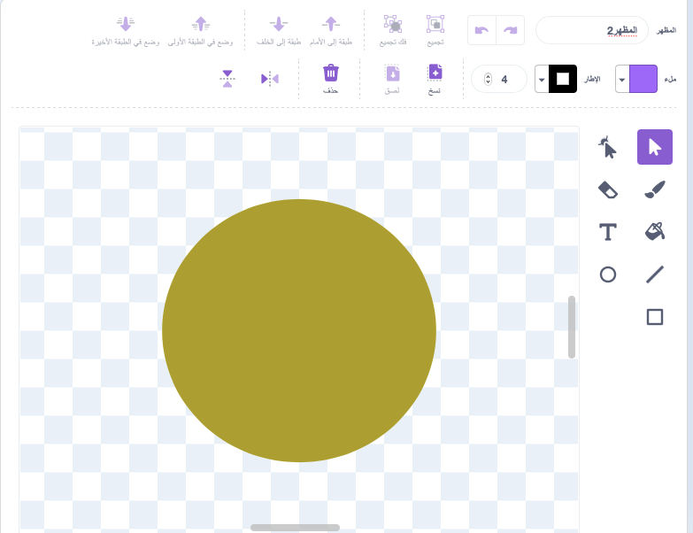
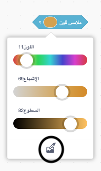

## تشغيل الموسيقى

<div style="display: flex; flex-wrap: wrap">
<div style="flex-basis: 200px; flex-grow: 1; margin-right: 15px;">
قم بإنشاء كائن يتفاعل مع **الآلة** الخاصة بك ويشغل الأصوات.
</div>
<div>
 <video width="320" height="240" controls>
  <source src="images/step-3-demo.mp4" type="video/mp4">
  متصفحك لا يدعم فيديو mp4.
</video>
</div>
</div>

ستعزف آلتك النغمات عندما يلامس كائن آخر ألوانًا مختلفة على **آلة الموسيقية** الخاص بك. هذا مشابه لكيفية عزف الجيتار للنغمات عندما يلامس الأوتار ، أو يعزف البيانو للنغمات عندما تضغط الأصابع على المفاتيح.

--- task ---

اصنع أو اختر كائنًا سيتبع مؤشر الماوس الخاص بك ويمكن استخدامه لتشغيل نغمات مختلفة. في المثال أدناه ، استخدمنا دائرة ملونة بسيطة.



--- /task ---

الآن ، اجعل كائنك يتتبع مؤشر الماوس ، حتى يتمكن الشخص الذي يعزف على الآلة من التحكم فيه.

--- task ---

أضف التعليمات البرمجية بحيث يتبع الكائن الجديد مؤشر الماوس.

```blocks3
when flag clicked
forever
go to (mouse-pointer v)
```
--- /task ---

استخدم `لبناتي`{:class='block3myblocks'} لتصميم شكل الآلة الموسيقية الخاصة بك.

<p style='border-left: solid; border-width:10px; border-color: #0faeb0; background-color: aliceblue; padding: 10px;'>يستخدم Scratch ما يسمى بقيم **midi** لضبط طبقة الصوت لأي نغمة يتم تشغيلها. قيمة **midi** "60" هي نفسها **C الأوسط**. كلما زادت قيمة **midi** ، زادت حدة النغمة.
</p>

--- task ---

هناك العديد من عناصر الموسيقى التي يمكنك تجربتها. يمكنك تغيير النغمات ، والآلة ، والإيقاعات ، توقف ، والإيقاع.

قم بإنشاء لبنة من`لبناتي/0>{:class='block3myblocks'} التي تحتوي على مدخلات للعديد من هذه العناصر كما تريد.

--- collapse ---
---
title: إنشاء لبنة مقطع موسيقي
---

```blocks3
define play note: (نغمة) beats (نبضة موسقى) rest (استراحة)
play note (نغمة) for (نبضة موسقى) beats
rest for (استراحة) beats
```

--- /collapse ---

--- /task ---

عندما يلامس الكائن الذي يتبع مؤشر الماوس لونًا معينًا على كائنك **الآلة** ، يجب تشغيل الصوت. يمكن أن يستخدم صانع الموسيقى الخاص بك  `تشغيل نغمة:`{:class='block3myblocks'} لتعيين أدوات مختلفة ، ونغمات ، ايقاعات ، توقف.

--- task ---

 أضف المقطع البرمجي`إذا ... والا`{:class='block3control'}`نغمة التشغيل:`{:class='block3myblocks'} إلى المقطع البرمجي كائن**الموسيقى**. أضف أي عدد من `إذا ... والا`{:class='block3control'} كما تريد.

 --- collapse ---
 ---
 title: استخدم المقطع نغمة اللعب الخاصة بك
 ---

```blocks3
when flag clicked
forever
if <touching color (#49c020) > then
play note: (60) beats (0.25) rest (0.25)::custom
end
if <touching color (#7f20c0) > then 
play note: (62) beats (0.25) rest (0.25)::custom
end
end
```

 --- /collapse ---

--- /task ---

--- task ---

**تصحيح:** قد تجد بعض الأخطاء في مشروعك والتي تحتاج إلى إصلاحها. فيما يلي بعض الأخطاء الشائعة.

--- collapse ---
---
title: لا تعزف الات العزف أي شيء عندما يلمسها كائني
---

هل استخدمت  **ملامس الألوان** لتحديد اللون الذي يقوم بتشغيل النغمة على `ملامس اللوان`{:class='block3sensing'}؟



--- /collapse ---

--- collapse ---
---
title: تعزف الالة الموسيقية نغمة واحدة فقط
---

أضف العديد من الألوان المختلفة كما تتطلب النغمات. في بعض الأحيان عندما يكون لديك ظلال لونية متشابهة جدًا ، فقد يتعرف عليها على أنها نفس اللون (وبالتالي تسمع نفس النغمة).

--- /collapse ---


--- collapse ---
---
title: يتم تشغيل الموسيقى بسرعة كبيرة جدًا أو ببطء شديد
---

يمكنك تغيير طول الفترة الزمنية التي يتم تشغيل النوتة خلالها ، وطول الفترة الزمنية بين النغمات. في `نغمة التشغيل:`{: class = 'block3myblocks'} ، اضبط قيم `ايقاع`{:class='block3myblocks'} و `استراحة`{:class='block3myblocks'} القيم. قم بزيادتها لإبطاء الموسيقى وتقليلها لتسريعها.

--- /collapse ---

--- collapse ---
---
title: تعزف الآلة نغمة بشكل متكرر حتى فخص نغمة اخرى
---

بعد ذلك ، ستعيد الأداة تشغيل نغمة موسيقية بناءً على طول الوقت الذي يتم فيه عزف النغمة الموسيقية. في `نغمة التشغيل:`{:class='block3myblocks'} ، اضبط قيم `ايقاع`{:class='block3myblocks'} و `استراحة`{:class='block3myblocks'} القيم. قم بزيادتها لإبطاء الموسيقى وتقليلها لتسريعها.

--- /collapse ---

--- /task ---

--- save ---

