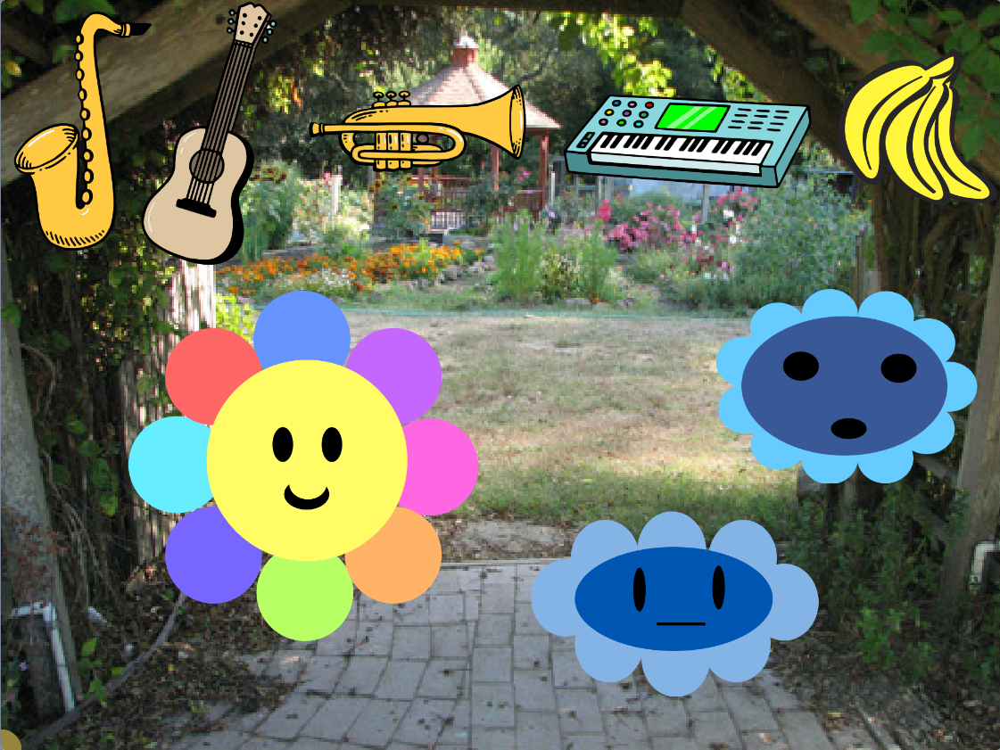

## تغيير الصوت

<div style="display: flex; flex-wrap: wrap">
<div style="flex-basis: 200px; flex-grow: 1; margin-right: 15px;">
أضف تفاعلًا بحيث يمكنك اختيار الأداة المستخدمة عند تشغيل الصوت.
</div>
<div>
 <video width="320" height="240" controls>
  <source src="images/step-4-demo.mp4" type="video/mp4">
  متصفحك لا يدعم فيديو mp4.
</video>
</div>
</div>

إن الشيء العظيم في الموسيقى الرقمية هو أنه يمكنك الحصول على آلة موسيقية واحدة لتشغيل أصوات العديد من الآلات المختلفة بسهولة.

--- task ---

أضف بعض الشخصيات المتحركة لتمثيل الأصوات المختلفة التي تريد أن تعزف عليها instrument. يمكنك استخدام كائنات ادوات الموسيقة، أو اختيار ما تريد ، فليس من الضروري أن يكون له معنى.



--- /task ---

يمكنك إضافة مقطع برمجي إلى كائن **pick** لتغيير الأداة التي يتم تشغيلها عندما يلمس **pick** كائنًا إضافيًا.

--- task ---

أضف مقطع برمجي داخل كتلة `للأبد`{:class='block3control'} ، بحيث عندما يلامس **pick** النقوش المتحركة ، تتغير الآلة الموسيقى التي يتم عزفها. على سبيل المثال:

```blocks3
when flag clicked
forever
if <touching (Guitar v) ?> then
set instrument to (Electric Guitar v)
end
```
--- /task ---

يمكنك تخصيص مشروعك لتشغيل أي صوت تريده عندما يلمس الاختيار **pick** آلة أو كائنًا أو شخصية على المنصة.

--- task ---

**تصحيح:** قد تجد بعض الأخطاء في مشروعك والتي تحتاج إلى إصلاحها. فيما يلي بعض الأخطاء الشائعة.

--- collapse ---
---
title: يتغير الصوت إلى الصوت الخطأ
---

تأكد من أن شرط `اذا`{:class="block3control"} في مجموعة `الاستشعار`{:class='block3control'} يطابق الآلة أو الصوت الذي تريده من ادراج اضافة `موسيقى`{:class='block3custom'}.

```blocks3
when flag clicked
forever
+ if <touching (Guitar v) ?> then
+ set instrument to (Electric Guitar v)
end
```

--- /collapse ---

--- /task ---
