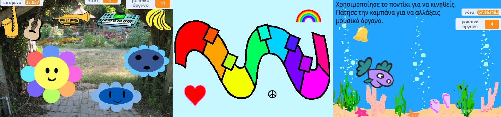
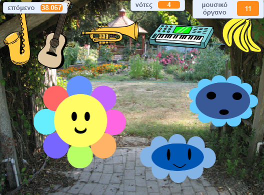
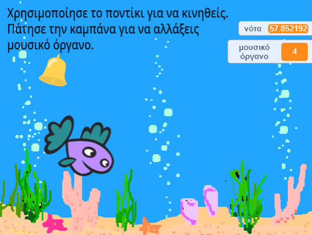

## Θα φτιάξεις

Σχεδίασε το δικό σου δημιουργό ψηφιακής μουσικής! Επινόησε ένα ψηφιακό μουσικό όργανο και πειραματίσου με τους ήχους, τα χρώματα, και πολλά άλλα.

**Ψηφιακή μουσική**είναι η μουσική η οποία είναι φτιαγμένη από νούμερα με τη βοήθεια των υπολογιστών. Η ψηφιακή μουσική βρίσκεται παντού — πόσο συχνά ακούς μουσική που προέρχεται από τηλέφωνο, υπολογιστή ή τηλεόραση;

Θα χρειαστεί να:
+ Σχεδιάσεις το δικό σου εικονικό μουσικό όργανο
+ Προσαρμόσεις την αλληλεπίδραση του χρήστη με τη μουσική
+ Εξερευνήσεις τη σχέση ανάμεσα στα μαθηματικά και τη μουσική

--- no-print ---

### Παίξε▶️

--- task ---

  
Τοποθέτησε το δείκτη του ποντικιού με τον κέρσορα (ή το δάχτυλό σου, αν είσαι σε tablet), πάνω από διαφορετικά μέρη του λουλουδιού. Τι μπορείς να ακούσεις; Δοκίμασε να αλλάξεις τον ήχο πατώντας πάνω στο όργανο στην κορυφή του.

  <iframe allowtransparency="true" width="485" height="402" src="" frameborder="0"></iframe>

--- /task ---

### Πάρε ιδέες💭

Θα χρειαστεί να πάρεις κάποιες σχεδιαστικές αποφάσεις για να φτιάξεις το δικό σου όργανο, αποφασίζοντας πως αλληλεπιδρά και πως ακούγεται.

--- task ---

Μελέτησε τα παρακάτω παραδείγματα έργων για να πάρεις ιδέες:

  <iframe allowtransparency="true" width="485" height="402" src="" frameborder="0"></iframe>

  <iframe allowtransparency="true" width="485" height="402" src="" frameborder="0"></iframe>

  <iframe allowtransparency="true" width="485" height="402" src="" frameborder="0"></iframe>

--- print-only ---

### Πάρε ιδέες 💭

Θα χρειαστεί να πάρεις κάποιες σχεδιαστικές αποφάσεις για να φτιάξεις το δικό σου όργανο, αποφασίζοντας πως αλληλεπιδρά και πως ακούγεται. Δες παρακάτω παραδείγματα έργων για έμπνευση.

 Scratch 1: Μουσικά λουλούδια– Παραδείγματα : https://scratch.mit.edu/studios/520146902/ Scratch studio.

 Scratch 1: Groovy αρμόνιο – Παραδείγματα: https://scratch.mit.edu/studios/546067020 Scratch studio.

 Scratch 1: Μουσικό ψάρι – Παραδείγματα: https://scratch.mit.edu/studios/106040821/ Scratch studio.

--- /print-only ---
