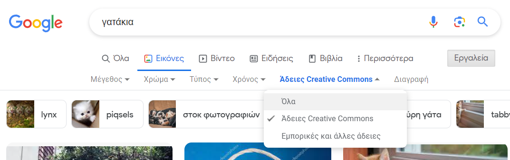
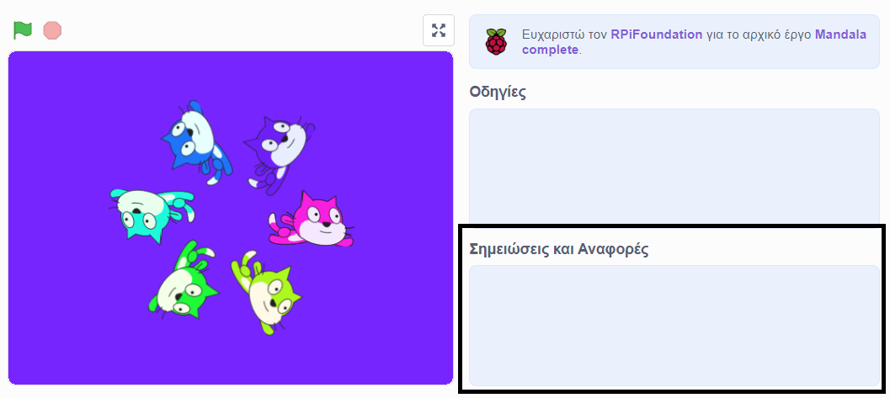
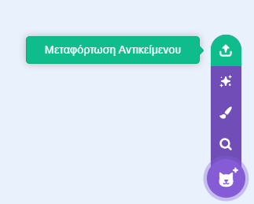

## Δημιούργησε ένα όργανο

Θα δημιουργήσεις ένα νέο αντικείμενο που θα αναπαράγει ήχους ανάλογα με το πού ο χρήστης τοποθετεί τον δείκτη του ποντικιού του ή αλληλεπιδρά με τη σκηνή.

 <video width="320" height="240" controls>
  <source src="images/step-2-demo.mp4" type="video/mp4">
  Το πρόγραμμα περιήγησής σου δεν υποστηρίζει τα αρχεία βίντεο mp4.
</video> 

--- task ---

Άνοιξε ένα [νέο έργο Scratch](http://rpf.io/scratch-new){:target="_ blank"}. Το Scratch θα ανοίξει σε νέα καρτέλα του φυλλομετρητή.

[[[working-offline]]]

--- /task ---

Το αντικείμενο **μουσικό όργανο** θα παίζει διαφορετικές νότες, ανάλογα με τα χρώματα που απαρτίζουν το αντικείμενο μουσικό όργανο. Θα πρέπει να επιλέξεις πώς θα μοιάζει το μουσικό όργανό σου. Θέλεις το μουσικό όργανό σου να μοιάζει με κάποιο παραδοσιακό όργανο ή κάτι που βλέπεις στο σπίτι σου ή έξω;

--- task ---

**Επίλεξε:** Πώς θα μοιάζει το αντικείμενο σου **μουσικό όργανο**; Χρησιμοποίησε το εργαλείο **Ζωγραφική** για να σχεδιάσεις ένα τρίγωνο. Στο παρακάτω παράδειγμα, το μουσικό όργανο μοιάζει με λουλούδι.

Σκέψου πόσους διαφορετικούς ήχους θέλεις να παίζει το μουσικό σου όργανο. Βεβαιώσου ότι το μουσικό όργανό σου έχει τουλάχιστον τόσα διαφορετικά χρώματα.

--- /task ---

--- task ---

Επίλεξε το αντικείμενο **μουσικό όργανο**.

Θέλεις να:
- Προσθέσεις ένα αντικείμενο από τη λίστα αντικειμένων;
- Προσαρμόσεις ένα αντικείμενο από τη λίστα αντικειμένων για να δημιουργήσεις κάτι καινούριο;
- Να μεταφορτώσεις ένα αντικείμενο;
- Ζωγραφίσεις το δικό σου αντικείμενο;

--- collapse ---
---
title: Προσαρμογή αντικειμένων
---

Αυτό το groovy πληκτρολόγιο προσαρμόστηκε από το αντικείμενο **Φίδι**:

Για να προσαρμόσεις αντικείμενα, επίλεξε το αντικείμενο και πήγαινε στον επεξεργαστή ζωγραφικής.

Εάν θέλεις απλώς ένα μέρος του αντικειμένου, μπορείς να το περικόψεις.

Εάν θέλεις μόνο το περίγραμμα του αντικειμένου, μετατρέψε το σε bitmap και χρησιμοποίησε το εργαλείο **Γέμισμα**.

--- /collapse ---

[[[generic-scratch3-draw-sprite]]]

--- collapse ---
---
title: Εύρεση εικόνων που μπορείς να χρησιμοποιήσεις
---

Το άτομο ή η εταιρεία που δημιουργεί μια εικόνα, είτε χρησιμοποιώντας προγράμματα γραφικών είτε με κάμερα, κατέχει τα δικαιώματα αυτής της εικόνας. Αυτό σημαίνει ότι δεν μπορείς να χρησιμοποιήσεις την εικόνα χωρίς να ζητήσεις πρώτα την άδειά τους.

Μερικές φορές οι εικόνες έχουν **άδεια** που επιτρέπει τη χρήση τους χωρίς να ζητηθεί πρώτα άδεια. Οι μηχανές αναζήτησης όπως η Google σου επιτρέπουν να κάνεις αναζήτηση για αυτούς τους τύπους εικόνων.

Οι περισσότερες από αυτές τις εικόνες θα ζητήσουν από εσένα να **αναφέρεις** τον δημιουργό. Επομένως, θα πρέπει να προσθέσεις έναν σύνδεσμο προς τον ιστότοπο στον οποίο τις βρήκες. μπορείς να το προσθέσεις στην ενότητα **Σημειώσεις και Αναφορές** της σελίδας του έργου σου.

--- /collapse ---

[[[generic-get-picture-from-web]]]

--- collapse ---
---
title: Μεταφόρτωση αντικειμένου στο Scratch
---

- Πήγαινε στο **Επιλέξτε ένα Αντικείμενο** και επίλεξε **Μεταφόρτωση Αντικειμένου**.

- Χρησιμοποίησε το πρόγραμμα περιήγησης αρχείων σου για να επιλέξεις το αντικείμενο που θέλεις να ανεβάσεις.

--- /collapse ---

--- /task ---

--- task ---

**Εντοπισμός σφαλμάτων:** Μπορεί να έχεις ήδη εντοπίσει πολλές φορές σφάλματα! Άλλαξες την κατεύθυνση που έδειχνε το αντικείμενό σου; Έλυσες κάποιο πρόβλημα; Σκέψου όλα τα σφάλματα που έχετε ήδη εντοπίσει και διορθώσει για να δημιουργήσεις το μουσικό σου όργανο.

--- /task ---

--- save ---
