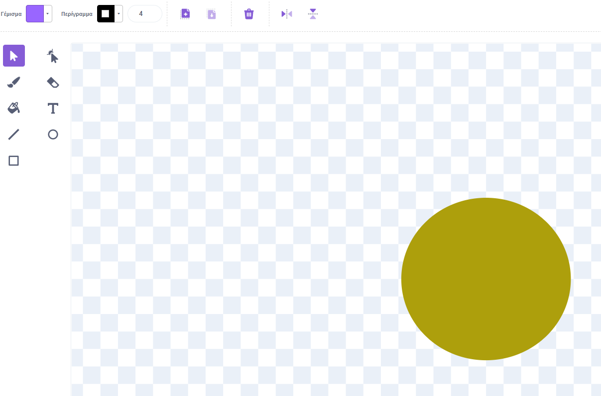
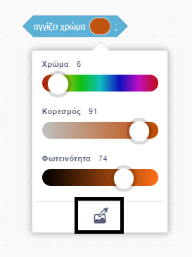

## Παίξε μουσική

<div style="display: flex; flex-wrap: wrap">
<div style="flex-basis: 200px; flex-grow: 1; margin-right: 15px;">
Δημιούργησε ένα αντικείμενο που θα αλληλεπιδρά με το αντικείμενο **μουσικό όργανο** σου και θα παίζει ήχους.
</div>
<div>
 <video width="320" height="240" controls>
  <source src="images/step-3-demo.mp4" type="video/mp4">
  Το πρόγραμμα περιήγησής σου δεν υποστηρίζει τα αρχεία βίντεο mp4.
</video>
</div>
</div>

Το μουσικό όργανό σου θα παίζει νότες όταν ένα άλλο αντικείμνο αγγίζει τα διαφορετικά χρώματα στο αντικείμενο **μουσικό όργανο** σου. Αυτό είναι παρόμοιο με το πώς μια κιθάρα παίζει νότες όταν μια πένα αγγίζει τις χορδές ή ένα πιάνο παίζει νότες όταν τα δάχτυλα πατούν τα πλήκτρα.

--- task ---

Δημιούργησε ή επίλεξε ένα αντικείμενο που θα ακολουθεί τον δείκτη του ποντικιού σου και μπορεί να χρησιμοποιηθεί για την αναπαραγωγή διαφορετικών νότων. Στο παρακάτω παράδειγμα, χρησιμοποιήσαμε έναν απλό έγχρωμο κύκλο.



--- /task ---

Τώρα, βάλε το αντικείμενό σου να ακολουθεί τον δείκτη του ποντικιού σου, ώστε το άτομο που παίζει το όργανο να μπορεί να το ελέγξει.

--- task ---

Πρόσθεσε κώδικα έτσι ώστε το νέο σου αντικείμενο να ακολουθεί τον δείκτη του ποντικιού.

```blocks3
when flag clicked
forever
go to (mouse-pointer v)
```
--- /task ---

Χρησιμοποίησε τις `Εντολές μου`{:class='block3myblocks'} για να σχεδιάσεις πώς ακούγεται το μουσικό σου όργανό.

<p style='border-left: solid; border-width:10px; border-color: #0faeb0; background-color: aliceblue; padding: 10px;'>Το Scratch χρησιμοποιεί τις λεγόμενες τιμές **midi** για να ορίσει το ύψος οποιασδήποτε νότας παίζεται. Μια τιμή **midi** `60` σημαίνει **μεσαίο Ντο**. Όσο υψηλότερη είναι η τιμή **midi**, τόσο μεγαλύτερο είναι το ύψος της νότας.
</p>

--- task ---

Υπάρχουν πολλά στοιχεία μουσικής με τα οποία μπορείς να πειραματιστείς. Μπορείς να αλλάξεις τις νότες, το μουσικό όργανο, τους χτύπους, την παύση και το ρυθμό.

Δημιούργησε ένα μπλοκ `Οι εντολές μου`{:class='block3myblocks'} που έχει εισόδους για όσα από αυτά τα στοιχεία θέλεις.

--- collapse ---
---
title: Δημιούργησε ένα προσαρμοσμένο μπλοκ μουσικής
---

```blocks3
define παίξε νότα: (νότα) χτύποι (χτύποι) παύση (παύση)
play note (νότα) for (χτύποι) beats
rest for (παύση) beats
```

--- /collapse ---

--- /task ---

Όταν το αντικείμενο που ακολουθεί το δείκτη του ποντικιού αγγίζει ένα συγκεκριμένο χρώμα στο αντικείμενο **μουσικό όργανό** σου, θα πρέπει να ακούγεται ένας ήχος. Ο δημιουργός μουσικής σου μπορεί να χρησιμοποιήσει το μπλοκ `παίξε νότα:`{:class='block3myblocks'} για να ορίσει διαφορετικάμουσικά όργανα, νότες, χτύπους και παύσεις.

--- task ---

 Πρόσθεσε μποκ `εάν...τότε`{:class='block3control'} και τα μπλοκ `παίξε νότα:`{:class='block3myblocks'} στο αντικείμενο **μουσικό όργανο**. Πρόσθεσε όσα μπλοκ `εάν...αλλιώς`{:class='block3control'} χρειάζεσαι.

 --- collapse ---
 ---
 title: Χρησιμοποίησε το μπλοκ "παίξε νότα"
 ---

```blocks3
when flag clicked
forever
if <touching color (#49c020) > then
παίξε νότα: (60) χτύποι (0.25) παύση (0.25)::custom
end
if <touching color (#7f20c0) > then 
παίξε νότα: (62) χτύποι (0.25) παύση (0.25)::custom
end
end
```

 --- /collapse ---

--- /task ---

--- task ---

**Εντοπισμός σφαλμάτων:** Ενδέχεται να βρεις κάποια σφάλματα στο έργο σου που πρέπει να διορθώσεις. Εδώ είναι μερικά κοινά σφάλματα.

--- collapse ---
---
title: Το μουσικό όργανό μου δεν παίζει τίποτα όταν το αγγίζει το αντικείμενό που έχω επιλέξει
---

Χρησιμοποίησες τον **επιλογέα χρώματος** για να επιλέξεις το χρώμα που παίζει μια νότα, στα μπλοκ `αγγίζει χρώμα`{:class='block3sensing'};



--- /collapse ---

--- collapse ---
---
title: Το μουσικό όργανό μου παίζει μόνο μία νότα
---

Πρόσθεσε τόσα διαφορετικά χρώματα όσες νότες επιθυμείς. Μερικές φορές, όταν έχεις αρκετά παρόμοιες αποχρώσεις χρώματος, μπορεί να τις αναγνωρίσει ως το ίδιο χρώμα (και επομένως να παίξει την ίδια νότα).

--- /collapse ---


--- collapse ---
---
title: Η μουσική παίζει πολύ γρήγορα ή πολύ αργά
---

Μπορείς να αλλάξεις τη διάρκεια αναπαραγωγής μιας νότας και τη χρονική διάρκεια μεταξύ των νοτών. Στο μπλοκ `παίξε νότα:`{:class='block3myblocks'}, προσάρμοσε τις τιμές `χτύποι`{:class='block3myblocks'} και `παύση`{:class='block3myblocks'}. Αύξησέ τις για να επιβραδύνεις τη μουσική και μείωσέ τις για να την επιταχύνεις.

--- /collapse ---

--- collapse ---
---
title: Το μουσικό όργανο παίζει μια νότα επανειλημμένα μέχρι να δοκιμάσω μια άλλη νότα
---

Στη συνέχεια, το μουσικό όργανο θα επαναλάβει μια νότα ανάλογα με το χρονικό διάστημα για το οποίο παίζεται η νότα. Στο μπλοκ `παίξε νότα:`{:class='block3myblocks'}, προσάρμοσε τις τιμές `χτύποι`{:class='block3myblocks'} και `παύση`{:class='block3myblocks'}. Αύξησέ τις για να επιβραδύνεις τη μουσική και μείωσέ τις για να την επιταχύνεις.

--- /collapse ---

--- /task ---

--- save ---

