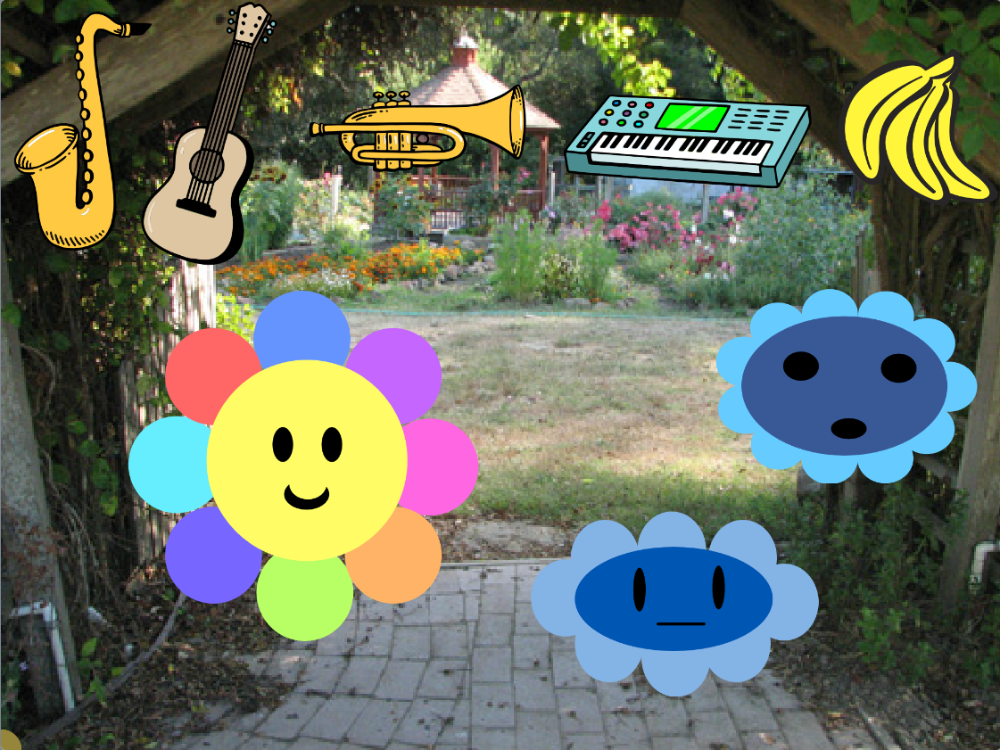

## Άλλαξε τον ήχο

<div style="display: flex; flex-wrap: wrap">
<div style="flex-basis: 200px; flex-grow: 1; margin-right: 15px;">
Πρόσθεσε αλληλεπίδραση, ώστε να μπορείς να επιλέξεις ποιο μουσικό όργανο χρησιμοποιείται όταν ακούγεται ένας ήχος.
</div>
<div>
 <video width="320" height="240" controls>
  <source src="images/step-4-demo.mp4" type="video/mp4">
  Το πρόγραμμα περιήγησής σου δεν υποστηρίζει τα αρχεία βίντεο mp4.
</video>
</div>
</div>

Το υπέροχο με την ψηφιακή μουσική είναι ότι μπορείς να χρησιμοποιήσεις ένα αντικείμενο μουσικού οργάνου για να παίζεις εύκολα τους ήχους πολλών διαφορετικών μουσικώ οργάνων.

--- task ---

Πρόσθεσε μερικά αντικείμενα για να αντιπροσωπεύσουν τους διαφορετικούς ήχους που θέλεις να παίζει το μουσικό όργανό σου. Μπορείς να χρησιμοποιήσεις αντικείμενα μουσικών οργάνων ή να επιλέξεις οτιδήποτε θέλεις, δεν χρειάζεται να βγάζει νόημα.



--- /task ---

Μπορείς να προσθέσεις κώδικα στο αντικείμενο **πένα** για να αλλάξεις το μουσικό όργανο που παίζεται όταν το αντικείμενο **πένα** αγγίζει τα υπόλοιπα αντικείμενά σας.

--- task ---

Πρόσθεσε κώδικα μέσα σε ένα μπλοκ `Για πάντα`{:class='block3control'}, έτσι ώστε όταν η **πένα** αγγίζει τα διαφορετικά αντικείμενα, το μουσικό όργανο που παίζεται να αλλάζει. Για παράδειγμα:

```blocks3
when flag clicked
forever
if <touching (Guitar v) ?> then
set instrument to (Electric Guitar v)
end
```
--- /task ---

Μπορείς να προσαρμόσεις το έργο σου ώστε να παίζει όποιον ήχο θέλεις όταν η **πένα**αγγίζει ένα όργανο, αντικείμενο ή χαρακτήρα στη Σκηνή.

--- task ---

**Εντοπισμός σφαλμάτων:** Ενδέχεται να βρεις κάποια σφάλματα στο έργο σου που πρέπει να διορθώσεις. Εδώ είναι μερικά κοινά σφάλματα.

--- collapse ---
---
title: Ο ήχος αλλάζει σε λάθος ήχο
---

Βεβαιώσου ότι η συνθήκη `Εάν`{:class="block3control"} στο μπλοκ `Αισθητήρα`{:class='block3control'} ταιριάζει με το όργανο ή τον ήχο που ήθελες από την επέκταση `Μουσική`{:class='block3custom'}.

```blocks3
when flag clicked
forever
+ if <touching (Guitar v) ?> then
+ set instrument to (Electric Guitar v)
end
```

--- /collapse ---

--- /task ---
