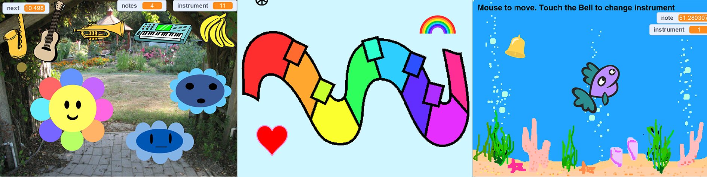
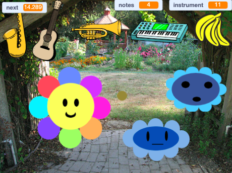
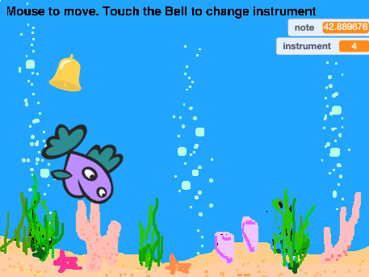

## Introduction

Design your own digital music maker! Invent a virtual musical instrument and experiment with sounds, colour, and more.

**Digital music** is music that is made with numbers using computers. Digital music is everywhere — how often do you experience music coming from a phone, computer, or television?

You will:
+ Design your own virtual musical instrument
+ Customise the user interaction with the music
+ Explore the relationship between maths and music

--- no-print ---

--- task ---

  

### Try it 

Hover with your cursor (or finger if you are on a tablet), over different parts of the flower. What can you hear? Try changing the sound by clicking on the instruments at the top.

**Musical flowers**: [See inside](https://scratch.mit.edu/projects/520146902/editor){:target="_blank"}

  <iframe allowtransparency="true" width="485" height="402" src="https://scratch.mit.edu/projects/embed/520146902/?autostart=false" frameborder="0"></iframe>

--- /task ---

### Get inspiration 

You are going to make some design decisions to create your own instrument, deciding how it interacts and what it sounds like. 

--- task ---

Explore these example projects to get more ideas:

**Groovy keyboard**: [See inside](https://scratch.mit.edu/projects/546067020/editor){:target="_blank"}

  <iframe allowtransparency="true" width="485" height="402" src="https://scratch.mit.edu/projects/embed/546067020/?autostart=false" frameborder="0"></iframe>

**Musical fish**: [See inside](https://scratch.mit.edu/projects/106040821/editor){:target="_blank"}

  <iframe allowtransparency="true" width="485" height="402" src="https://scratch.mit.edu/projects/embed/106040821/?autostart=false" frameborder="0"></iframe>

**Musical flowers**: [See inside](https://scratch.mit.edu/projects/520146902/editor){:target="_blank"}

  <iframe allowtransparency="true" width="485" height="402" src="https://scratch.mit.edu/projects/embed/520146902/?autostart=false" frameborder="0"></iframe>

--- /task ---
--- /no-print ---

--- print-only ---

### Get inspiration 

You are going to make some design decisions to create your own instrument, deciding how it interacts and what it sounds like. See inside the example projects below for inspiration. 

Scratch 1: Musical flowers – Examples : https://scratch.mit.edu/studios/520146902/ Scratch studio.

Scratch 1: Groovy keyboard – Examples : https://scratch.mit.edu/studios/546067020 Scratch studio.

Scratch 1: Musical fish – Examples : https://scratch.mit.edu/studios/106040821/ Scratch studio.

--- /print-only ---
