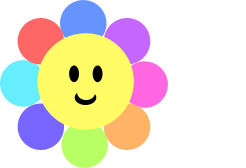
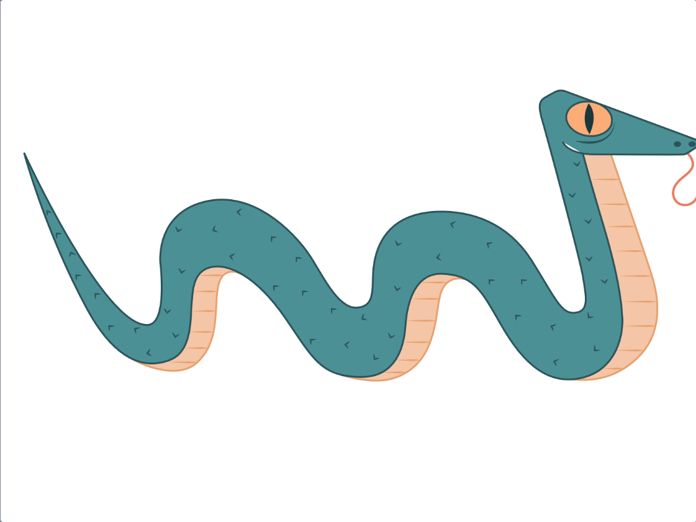
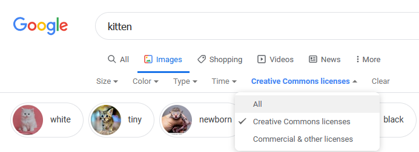
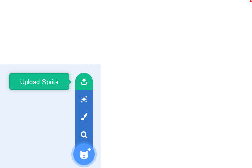

## Create an instrument

You will create a new sprite that will play sounds depending on where the user places their mouse pointer, or interacts with the scene.

 <video width="320" height="240" controls>
  <source src="images/step-2-demo.mp4" type="video/mp4">
  Your browser does not support mp4 video.
</video> 

--- task ---

Open a [new Scratch project](http://rpf.io/scratch-new){:target="_blank"}. Scratch will open in another browser tab.

[[[working-offline]]]

--- /task ---

Your **instrument** sprite will play different notes, depending on the colours that make up the instrument sprite. You will need to choose what your instrument looks like. Do you want your instrument to look like a traditional instrument or something you see in your house or outside?

--- task ---

**Choose:** what your **instrument** sprite looks like, and use the Paint Tool to create it. In the example below, the instrument looks like a flower. 

Think about how many different sounds you want your instrument to play. Make sure your instrument has at least that many different colours.

--- /task ---

--- task ---

Create your instrument sprite.

Do you want to:
- Add a sprite from the sprite list?
- Adapt a sprite from the sprite list to make something new?
- Upload a sprite?
- Paint your own sprite?

--- collapse ---
---
title: Adapting sprites
---

This groovy keyboard was adapted from the Snake sprite:

To adapt sprites, select the sprite you want and go to the paint editor.

If you just want part of the sprite, you can crop it.

THERE SHOULD BE SOMETHING HERE FROM SPACE TALK

If you want just the outline of the sprite, convert it to a bitmap and use the **Fill** tool

CHECK FOR FILL IMAGES/INGREDIENT

--- /collapse ---

[[[generic-scratch3-draw-sprite]]]

--- collapse ---
---
title: Finding images you can use
---

The person or company that creates and image, either using graphics programs or with a camera, have the rights to that image. This means that you can not use the image, without asking their permission first.

Sometimes images have a **license** that allows them to be used without asking for permission first. Search engines like Google, allow you to search for these types of images.

Most of these images will require you to **attribute** the creator. So you should add a link to the website you found them on, in to the **Notes and Credits** section of you project page.elements

--- /collapse ---

[[[generic-get-picture-from-web]]]

--- collapse ---
---
title: Uploading a sprite to Scratch
---

- Use the **Choose a Sprite** menu and select **Upload Sprite**.

- Use your file broswer to select the sprite you wish to upload.

--- /collapse ---

--- /task ---

**Debug:** 

[[[SPRITE WRONG DIRECTION INGREDIENT]]]
