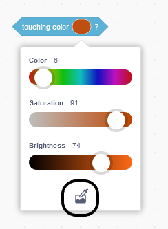

## Play music

<div style="display: flex; flex-wrap: wrap">
<div style="flex-basis: 200px; flex-grow: 1; margin-right: 15px;">
Create a sprite that will interact with your instrument and play sounds.
</div>
<div>
 <video width="320" height="240" controls>
  <source src="images/step-3-demo.mp4" type="video/mp4">
  Your browser does not support mp4 video.
</video>
</div>
</div>

Your instrument will play notes when another sprite touches different colours on your instrument sprite. This is similar to how a guitar will play notes when a pick touches the strings, or a piano plays notes when fingers press on the keys.

--- task ---

Make or choose a sprite that will follow your mouse pointer and be used to play different notes. In the example below, we have used a simple coloured circle.


--- /task ---

Now, get your sprite to follow your mouse pointer, so that the person playing the instrument can control it.

--- task ---

Add code so that your new sprite follows the mouse pointer.

```blocks3
when flag clicked
forever
go to (mouse-pointer v)
```
--- /task ---

Use `My Blocks`{:class='block3myblocks'} to design what your instrument sounds like.

<p style='border-left: solid; border-width:10px; border-color: #0faeb0; background-color: aliceblue; padding: 10px;'>Scratch uses what are called **midi** values to set the pitch of any note that is played. A **midi** value of `60` is the same as **middle C**. The higher the **midi** value, the higher the pitch of the note.
</p>

--- task ---

There are many elements of music that you can experiment with. You can change the notes, instrument, beats, rest, and tempo.

Create a `My Blocks`{:class='block3myblocks'} block that has inputs for as many of these elements as you want.

--- collapse ---
---
title: Create a custom musical block
---

```blocks3
define play note: (note) beats (beats) rest (rest)
play note (note) for (beats) beats
rest for (rest) beats
```

--- /collapse ---

--- /task ---

When the sprite that is following the mouse pointer, touches a specific colour on your **instrument** a sound should be played. Your music maker can use the `play note`{:class='block3myblocks'} block to set different instruments, notes, beats and rests.

--- task ---

 Add `if...then`{:class='block3control'} blocks and the `play note:`{:class='block3myblocks'} blocks to your instrument sprite. Add as many `if...else`{:class='block3control'} blocks as you need.

 --- collapse ---
 ---
 title: Use your play note block
 ---
 
```blocks3
when flag clicked
forever
if <touching color (#49c020) > then
play note: (60) beats (0.25) rest (0.25)::custom
end
if <touching color (#7f20c0) > then 
play note: (62) beats (0.25) rest (0.25)::custom
end
end
```
 
 --- /collapse ---

--- /task ---

--- task ---

**Debug:** You might find some bugs in your project that you need to fix. Here are some common bugs.

--- collapse ---
---
title: My instrument does not play anything when my sprite touches it
---

Did you use the **color picker** to select the colour that played a note, on your `touching color`{:class='block3sensing'} blocks?



--- /collapse ---

--- collapse ---
---
title: My instrument only plays one note
---

Add as many different colours as you want notes. Sometimes when you have very similar shades of colour, it may recognize it as the same colour (and therefore note).

--- /collapse ---


--- collapse ---
---
title: The music plays too quickly or too slow
---

You can change the length of time that a note plays for, and for the time between notes. In your `play note:`{:class='block3myblocks'} block adjust the `beats`{:class='block3myblocks'} and `rest`{:class='block3myblocks'} values. Increase them to slow down the music, and decrease them to speed it up.

--- /collapse ---

--- collapse ---
---
title: The instrument plays a note repeatedly until I try another note
---

You can change the length of time that a note plays for, and for the time between notes. In your `play note:`{:class='block3myblocks'} block adjust the `beats`{:class='block3myblocks'} and `rest`{:class='block3myblocks'} values. Increase them to slow down the music, and decrease them to speed it up.

--- /collapse ---

--- /task ---

--- save ---

