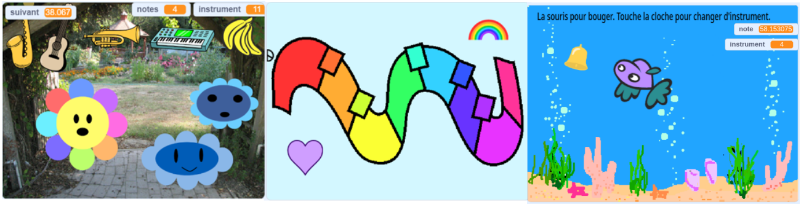
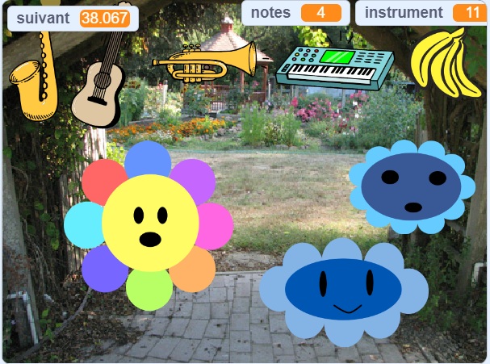
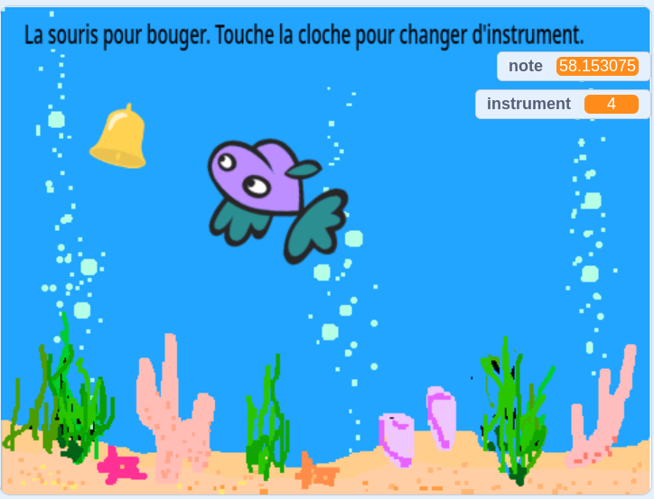

## You will make

Conçois ton propre créateur de musique numérique ! Invente un instrument de musique virtuel et expérimente-le avec des sons, des couleurs et plus encore.

La musique numérique est une musique faite avec des chiffres à l'aide d'ordinateurs. La musique numérique est partout - combien de fois as-tu entendu de la musique provenant d'un téléphone, d'un ordinateur ou d'un téléviseur ?

Tu vas devoir :
+ Concevoir ton propre instrument de musique virtuel
+ Personnaliser l'interaction de l'utilisateur avec la musique
+ Explorer la relation entre les mathématiques et la musique

--- no-print ---

### Play ▶️

--- task ---

  
Hover with your cursor (or finger if you are on a tablet), over different parts of the flower. Que peux-tu entendre ? Essaye de changer le son en cliquant sur les instruments en haut.

**Fleurs musicales** : [Voir à l'intérieur](https://scratch.mit.edu/projects/520146902/editor){:target="_blank"}

  <iframe allowtransparency="true" width="485" height="402" src="https://scratch.mit.edu/projects/embed/520146902/?autostart=false" frameborder="0"></iframe>

--- /task ---

### Get ideas 💭

Tu vas prendre certaines décisions de conception pour créer ton propre instrument, en décidant comment il interagit et quels sons il fait.

--- task ---

Explore ces exemples de projets pour obtenir plus d'idées :

**Clavier groovy** : [Voir à l'intérieur](https://scratch.mit.edu/projects/546067020/editor){:target="_blank"}

  <iframe allowtransparency="true" width="485" height="402" src="https://scratch.mit.edu/projects/embed/546067020/?autostart=false" frameborder="0"></iframe>

**Poisson musical** : [Voir à l'intérieur](https://scratch.mit.edu/projects/106040821/editor){:target="_blank"}

  <iframe allowtransparency="true" width="485" height="402" src="https://scratch.mit.edu/projects/embed/106040821/?autostart=false" frameborder="0"></iframe>

**Fleurs musicales** : [Voir à l'intérieur](https://scratch.mit.edu/projects/520146902/editor){:target="_blank"}

  <iframe allowtransparency="true" width="485" height="402" src="https://scratch.mit.edu/projects/embed/520146902/?autostart=false" frameborder="0"></iframe>

--- /task --- --- /no-print ---

--- print-only ---

### Get ideas 💭

Tu vas prendre certaines décisions de conception pour créer ton propre instrument, en décidant comment il interagit et quels sons il fait. Voir dans les exemples de projets ci-dessous pour t'inspirer.

 Scratch 1 : Fleurs musicales – Exemples : https://scratch.mit.edu/studios/520146902/ Scratch studio.

 Scratch 1 : Clavier Groovy – Exemples : https://scratch.mit.edu/studios/546067020 Scratch studio.

 Scratch 1 : Poisson musical – Exemples : https://scratch.mit.edu/studios/106040821/ Scratch studio.

--- /print-only ---
