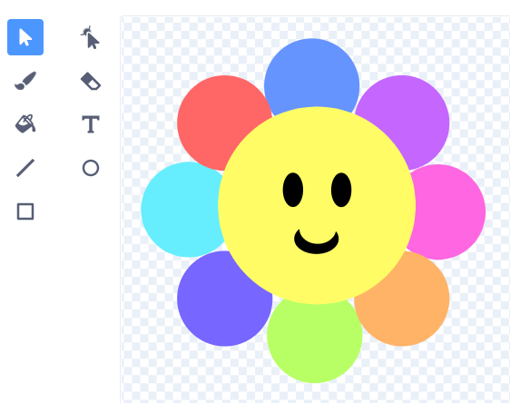
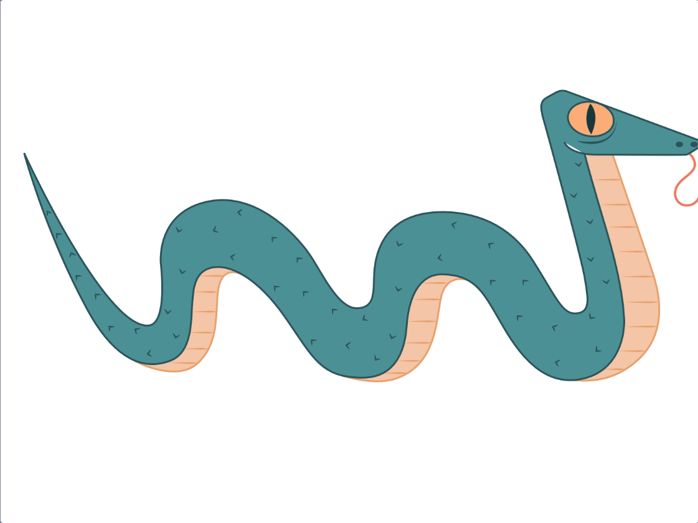
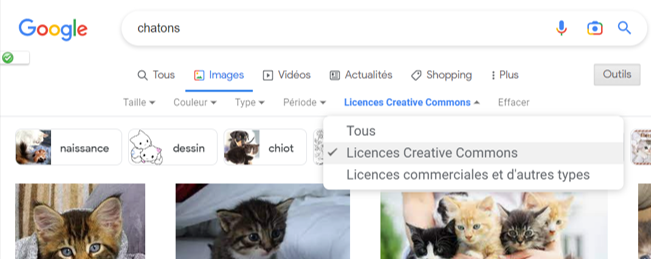
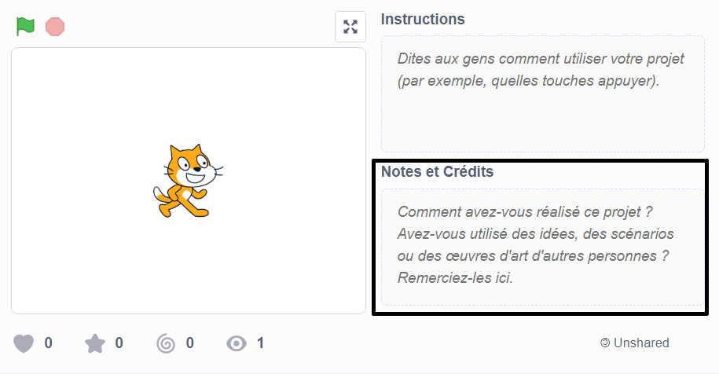
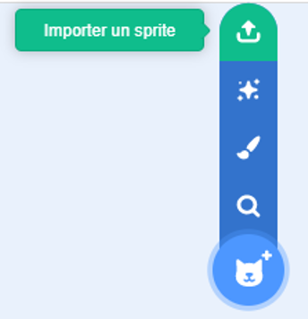

## Créer un instrument

Tu vas créer un nouveau sprite qui jouera des sons en fonction de l'endroit où l'utilisateur place le curseur de sa souris ou interagit avec la scène.

 <video width="320" height="240" controls>
  <source src="images/step-2-demo.mp4" type="video/mp4">
  Ton navigateur ne prend pas en charge le format de vidéo mp4.
</video> 

--- task ---

Ouvre un [nouveau projet Scratch](http://rpf.io/scratch-new){:target="_blank"}. Scratch s'ouvrira dans un autre onglet du navigateur.

[[[working-offline]]]

--- /task ---

Ton sprite instrument jouera des notes différentes, selon les couleurs qui composent le sprite instrument. Tu devras choisir à quoi ressemble ton instrument. Veux-tu que ton instrument ressemble à un instrument traditionnel ou à quelque chose que tu vois dans ta maison ou à l'extérieur ?

--- task ---

Choisir : à quoi ressemblera ton sprite instrument ? Utilise l'outil **Peindre** pour le créer. Dans l'exemple ci-dessous, l'instrument ressemble à une fleur.

Pense au nombre de sons différents que tu veux que ton instrument joue. Assure-toi que ton instrument possède au moins autant de couleurs différentes.

--- /task ---

--- task ---

Créer ton sprite instrument.

Veux-tu :
- Ajouter un sprite depuis la liste de sprite ?
- Adapter un sprite depuis la liste de sprite pour en faire un nouveau ?
- Télécharger un sprite ?
- Peindre ton propre sprite ?

--- collapse ---
---
title : Adapter les sprites
---

Ce clavier groovy a été adapté du sprite **Snake**:

Pour adapter les sprites, sélectionne le sprite souhaité et accéde à l'éditeur de peinture.

Si tu veux juste une partie du sprite, tu peux le recadrer.

Si tu veux juste le contour du sprite, convertis-le en bitmap et utilise l'outil Remplissage.

--- /collapse ---

[[[generic-scratch3-draw-sprite]]]

--- collapse ---
---
title : Trouver des images que tu peux utiliser
---

La personne ou l'entreprise qui crée une image, soit à l'aide de programmes graphiques, soit avec un appareil photo, détient les droits sur cette image. Cela signifie que tu ne peux pas utiliser l'image sans demander d'abord leur autorisation.

Parfois, les images ont une licence qui leur permet d'être utilisées sans demander d'autorisation préalable. Des moteurs de recherche comme Google te permettent de rechercher ce type d'image.

La plupart de ces images te demanderont de l'**attribuer** au créateur. Tu dois donc ajouter un lien vers le site Web sur lequel tu les as trouvés ; tu peux l'ajouter à la section **Notes and Credits** de la page de ton projet.

--- /collapse ---

[[[generic-get-picture-from-web]]]

--- collapse ---
---
title : Télécharger un sprite dans Scratch
---

- Utilise le menu **Choisir un Sprite** et sélectionne **Importer un Sprite**.

- Utilise ton navigateur de fichiers pour sélectionner le sprite que tu souhaites télécharger.

--- /collapse ---

--- /task ---

--- task ---

**Débogage :** Tu as peut-être déjà fait beaucoup de débogage ! As-tu changé la direction de ton sprite ? As-tu résolu des problèmes ? Pense à tout le débogage que tu as déjà effectué pour créer ton instrument de musique.

--- /task ---

--- save ---
