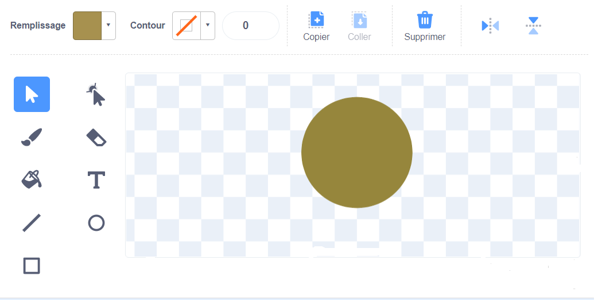
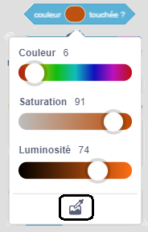

## Jouer de la musique

<div style="display: flex; flex-wrap: wrap">
<div style="flex-basis: 200px; flex-grow: 1; margin-right: 15px;">
Crée un sprite qui interagira avec ton sprite **instrument** et jouera des sons.
</div>
<div>
 <video width="320" height="240" controls>
  <source src="images/step-3-demo.mp4" type="video/mp4">
  Ton navigateur ne prend pas en charge le format de vidéo mp4.
</video>
</div>
</div>

Ton instrument jouera des notes lorsqu'un autre sprite touchera les différentes couleurs de ton sprite **instrument**. Ceci est similaire à la façon dont une guitare joue des notes lorsqu'un médiator touche les cordes, ou qu'un piano joue des notes lorsque les doigts appuient sur les touches.

--- task ---

Crée ou choisis un sprite qui suivra le curseur de ta souris et pourra être utilisé pour jouer différentes notes. Dans l'exemple ci-dessous, nous avons utilisé un simple cercle coloré.



--- /task ---

Maintenant, fais en sorte que ton sprite suive le curseur de ta souris, afin que la personne qui joue de l'instrument puisse le contrôler.

--- task ---

Ajoute du code pour que ton nouveau sprite suive le pointeur de la souris.

```blocks3
when flag clicked
forever
go to (mouse-pointer v)
```
--- /task ---

Utilise `Mes Blocs`{:class='block3myblocks'} pour concevoir le son de ton instrument.

<p style='border-left: solid; border-width:10px; border-color: #0faeb0; background-color: aliceblue; padding: 10px;'>Scratch utilise ce qu'on appelle des valeurs **midi** pour définir la hauteur de n'importe quelle note jouée. Une valeur **midi** de `60` est identique à **do médian**. Plus la valeur **midi** est élevée, plus la note est élevée.
</p>

--- task ---

Il existe de nombreux éléments de musique que tu peux expérimenter. Tu peux modifier les notes, l'instrument, les battements, les silences et le tempo.

Créez un bloc `Mes Blocs`{:class='block3myblocks'} qui a des entrées pour autant de ces éléments que tu le souhaites.

--- collapse ---
---
title : Créer un bloc musical personnalisé
---

```blocks3
define play note: (note) beats (beats) rest (rest)
play note (note) for (beats) beats
rest for (rest) beats
```

--- /collapse ---

--- /task ---

Lorsque le sprite qui suit le pointeur de la souris touche une couleur spécifique sur ton sprite **instrument** , un son doit être joué. Ton créateur de musique peut utiliser le bloc `jouer note:`{:class='block3myblocks'} pour définir différents instruments, notes, rythmes et silences.

--- task ---

 Ajoute `si...alors`blocs {:class='block3control'} et les blocs `jouer note:` {:class='block3myblocks'} à ton sprite **instrument**. Ajoute autant de blocs `si...alors`{:class='block3control'} que nécessaire.

 --- collapse ---
 ---
 title : Utilise ton bloc jouer note
 ---

```blocks3
when flag clicked
forever
if <touching color (#49c020) > then
play note: (60) beats (0.25) rest (0.25)::custom
end
if <touching color (#7f20c0) > then 
play note: (62) beats (0.25) rest (0.25)::custom
end
end
```

 --- /collapse ---

--- /task ---

--- task ---

**Débogage :** Il est possible que tu trouves des bogues dans ton projet que tu dois corriger. Voici quelques bogues assez courants.

--- collapse ---
---
title: Mon instrument ne joue rien quand mon sprite le touche
---

As-tu utilisé le **sélecteur de couleur** pour sélectionner la couleur qui joue une note, sur tes blocs `couleur touchée`{:class='block3sensing'} ?



--- /collapse ---

--- collapse ---
---
title : Mon instrument ne joue qu'une seule note
---

Ajoute autant de couleurs différentes que de notes souhaitées. Parfois, lorsque tu as des nuances de couleur très similaires, il peut les reconnaître comme étant de la même couleur (et donc jouer la même note).

--- /collapse ---


--- collapse ---
---
title : La musique joue trop vite ou trop lentement
---

Tu peux modifier la durée de lecture d'une note et la durée entre les notes. Dans ton bloc ` jouer note:`bloc {:class='block3myblocks'}, ajuste les valeurs de `battements`{:class='block3myblocks'} et de `silence`{:class='block3myblocks'}. Augmente-les pour ralentir la musique et diminue-les pour l'accélérer.

--- /collapse ---

--- collapse ---
---
title : L'instrument joue une note de manière répétée jusqu'à ce que j'essaie une autre note
---

Ensuite, l'instrument rejouera une note en fonction de la durée pendant laquelle la note est jouée. Dans ton bloc `jouer note :`bloc {:class='block3myblocks'}, ajuste les valeurs de `battements`{:class='block3myblocks'} et de `silence`{:class='block3myblocks'}. Augmente-les pour ralentir la musique et diminue-les pour l'accélérer.

--- /collapse ---

--- /task ---

--- save ---

