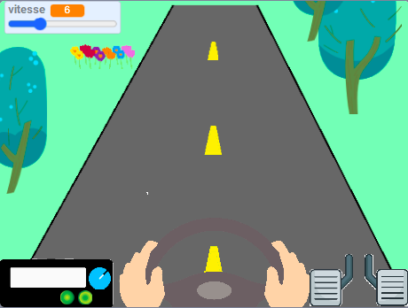

## Et ensuite ?

Si tu suis le parcours [Plus de Scratch](https://projects.raspberrypi.org/en/pathways/further-scratch), tu peux passer au projet [Bienvenue dans mon monde](https://projects.raspberrypi.org/en/projects/welcome-to-my-world). Dans ce projet, tu vas créer ton propre monde virtuel.

--- print-only ---

--- /print-only ---

--- no-print ---

  <iframe allowtransparency="true" width="485" height="402" src="https://scratch.mit.edu/projects/embed/548228231/?autostart=false" frameborder="0"></iframe>

--- /no-print ---

Si tu veux t'amuser davantage en explorant Scratch, tu peux essayer n'importe lequel de [ces projets](https://projects.raspberrypi.org/en/projects?software%5B%5D=scratch&curriculum%5B%5D=%201).
