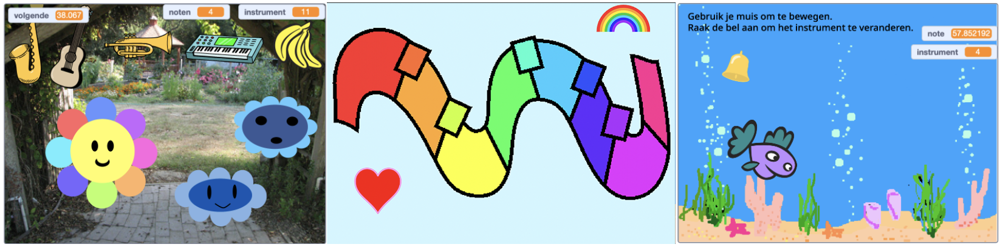
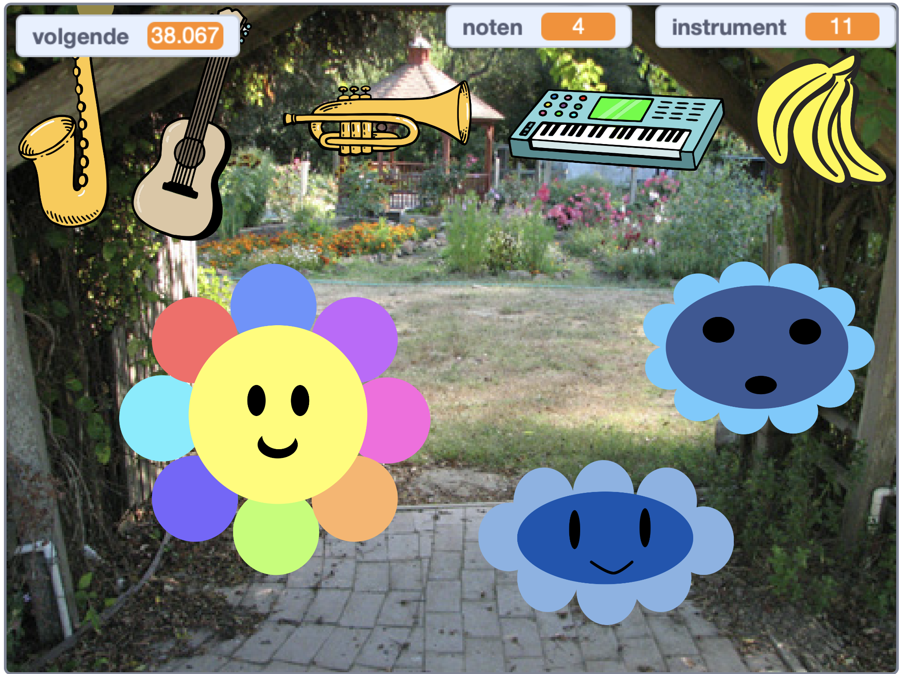
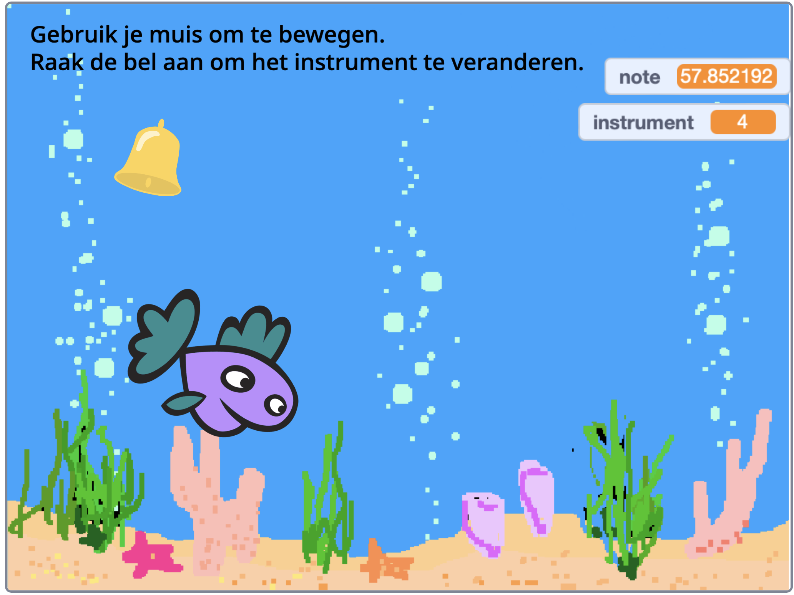

## You will make

Ontwerp je eigen digitale muziekmaker! Verzin een virtueel muziekinstrument en experimenteer met geluiden, kleuren en meer.

**digitale muziek** is muziek die wordt gemaakt met getallen door computers te gebruiken. Digitale muziek is overal: Hoe vaak hoor je muziek van een telefoon, computer of televisie?

Je gaat:
+ Je eigen virtuele muziekinstrument ontwerpen
+ De gebruikersinteractie met de muziek aanpassen
+ De relatie tussen wiskunde en muziek ontdekken

--- no-print ---

### Play ▶️

--- task ---

  
Hover with your cursor (or finger if you are on a tablet), over different parts of the flower. Wat kun je horen? Probeer het geluid te veranderen door op de instrumenten bovenaan te klikken.

**Muzikale bloemen**: [Bekijk van binnen](https://scratch.mit.edu/projects/520146902/editor){:target="_blank"}

  <iframe allowtransparency="true" width="485" height="402" src="https://scratch.mit.edu/projects/embed/520146902/?autostart=false" frameborder="0"></iframe>

--- /task ---

### Get ideas 💭

Je gaat een aantal ontwerpbeslissingen nemen om je eigen instrument te maken en te beslissen hoe alles samenwerkt en hoe het klinkt.

--- task ---

Bekijk deze voorbeeldprojecten om meer ideeën op te doen:

**Groovy keyboard**: [Bekijk van binnen](https://scratch.mit.edu/projects/546067020/editor){:target="_blank"}

  <iframe allowtransparency="true" width="485" height="402" src="https://scratch.mit.edu/projects/embed/546067020/?autostart=false" frameborder="0"></iframe>

**Muzikale vis**: [Bekijk van binnen](https://scratch.mit.edu/projects/106040821/editor){:target="_blank"}

  <iframe allowtransparency="true" width="485" height="402" src="https://scratch.mit.edu/projects/embed/106040821/?autostart=false" frameborder="0"></iframe>

**Musical flowers**: [See inside](https://scratch.mit.edu/projects/520146902/editor){:target="_blank"}

  <iframe allowtransparency="true" width="485" height="402" src="https://scratch.mit.edu/projects/embed/520146902/?autostart=false" frameborder="0"></iframe>

--- /task --- --- /no-print ---

--- print-only ---

### Get ideas 💭

Je gaat een aantal ontwerpbeslissingen nemen om je eigen instrument te maken en te beslissen hoe alles samenwerkt en hoe het klinkt. Kijk in de voorbeeldprojecten hieronder voor inspiratie.

 Scratch 1: Muzikale bloemen – voorbeelden : https://scratch.mit.edu/studios/520146902/ Scratch studio.

 Scratch 1: Groovy keyboard – voorbeelden : https://scratch.mit.edu/studios/546067020 Scratch studio.

 Scratch 1: Muzikale vis – voorbeelden : https://scratch.mit.edu/studios/106040821/ Scratch studio.

--- /print-only ---
