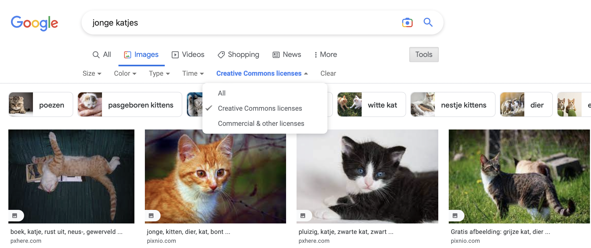
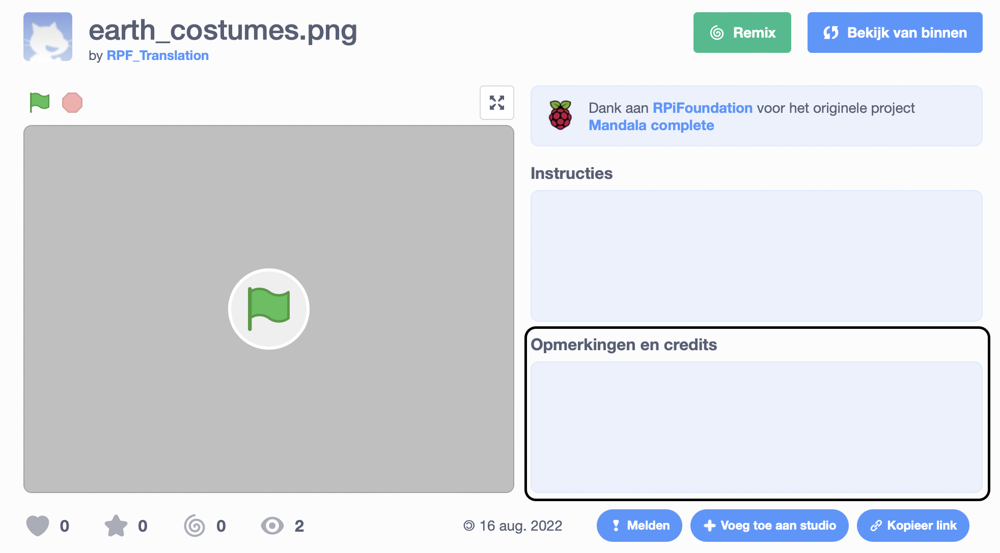
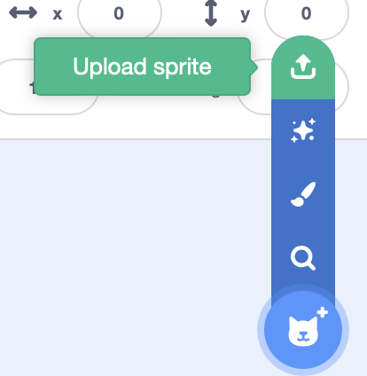

## Maak een instrument

Je maakt een nieuwe sprite die geluiden zal afspelen, afhankelijk van waar de gebruiker de muisaanwijzer plaatst of met de scène communiceert.

 <video width="320" height="240" controls>
  <source src="images/step-2-demo.mp4" type="video/mp4">
  Je browser ondersteunt geen mp4-video.
</video> 

--- task ---

Open een [nieuw Scratch-project](http://rpf.io/scratch-new){:target="_blank"}. Scratch wordt in een nieuw browsertabblad geopend.

[[[working-offline]]]

--- /task ---

Je **instrument** sprite speelt verschillende noten, afhankelijk van de kleuren waaruit de instrument-sprite bestaat. Je moet kiezen hoe je instrument eruit ziet. Wil je dat je instrument eruit ziet als een traditioneel instrument of iets wat je in je huis of buiten ziet?

--- task ---

**Kies:** Hoe ziet je **instrument** sprite eruit? Gebruik het **Teken** gereedschap om het te maken. In het onderstaande voorbeeld ziet het instrument eruit als een bloem.

Bedenk hoeveel verschillende geluiden je wilt dat je instrument speelt. Zorg ervoor dat je instrument minstens evenveel verschillende kleuren heeft.

--- /task ---

--- task ---

Maak je **instrument** sprite.

Wil je:
- Een sprite uit de sprite-lijst toevoegen?
- Een sprite uit de spritelijst aanpassen om iets nieuws te maken?
- Een sprite uploaden?
- Je eigen sprite tekenen?

--- collapse ---
---
Title: Sprites aanpassen
---

Dit groovy toetsenbord werd aangepast van de **Snake** sprite:

Om sprites aan te passen, selecteer je de sprite die je wilt en ga je naar de teken editor.

Als je gewoon een deel van de sprite wilt, kun je die bijsnijden.

Als je alleen de omtrek van de sprite wilt, converteer deze dan naar een bitmap en gebruik het **vullen** gereedschap.

--- /collapse ---

[[[generic-scratch3-draw-sprite]]]

--- collapse ---
---
title: Afbeeldingen zoeken die je kunt gebruiken
---

De persoon of het bedrijf dat een afbeelding maakt met behulp van grafische programma's of met een camera, is eigenaar van de rechten op die afbeelding. Dit betekent dat je de afbeelding niet kunt gebruiken zonder eerst hun toestemming te vragen.

Soms hebben afbeeldingen een **licentie** waarmee ze kunnen worden gebruikt zonder eerst om toestemming te vragen. Met zoekmachines zoals Google kun je naar dit soort afbeeldingen zoeken.

Voor de meeste van deze afbeeldingen moet je de maker **vermelden**. Je zou dus een link moeten toevoegen naar de website waarop je ze hebt gevonden; je zou deze kunnen toevoegen aan de **notities en credits** sectie van je projectpagina.

--- /collapse ---

[[[generic-get-picture-from-web]]]

--- collapse ---
---
title: Een sprite uploaden naar Scratch
---

- Gebruik het **Kies een Sprite** menu en selecteer **Upload Sprite**.

- Gebruik je bestandsbrowser om de sprite te te selecteren die je wilt uploaden.

--- /collapse ---

--- /task ---

--- task ---

**Debug:** je hebt misschien al veel foutopsporing gedaan! Heb je de richting van je sprite veranderd? Heb je problemen opgelost? Denk aan alle foutopsporing die je al hebt gedaan om je muziekinstrument te maken.

--- /task ---

--- save ---
