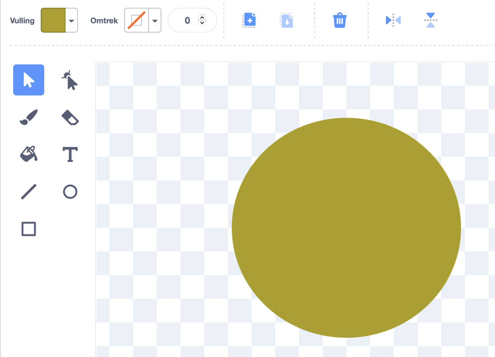
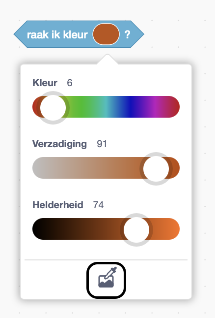

## Speel muziek af

<div style="display: flex; flex-wrap: wrap">
<div style="flex-basis: 200px; flex-grow: 1; margin-right: 15px;">
Maak een sprite die met je **instrument** sprite zal communiceren en geluiden zal afspelen.
</div>
<div>
 <video width="320" height="240" controls>
  <source src="images/step-3-demo.mp4" type="video/mp4">
  Je browser ondersteunt geen mp4-video.
</video>
</div>
</div>

Je instrument speelt noten wanneer een andere sprite de verschillende kleuren van je **instrument** sprite raakt. Dit is vergelijkbaar met hoe een gitaar noten speelt wanneer een plectrum de snaren raakt, of een piano noten speelt wanneer vingers op de toetsen drukken.

--- task ---

Maak of kies een sprite die je muisaanwijzer volgt en kan worden gebruikt om verschillende noten te spelen. In het onderstaande voorbeeld hebben we een eenvoudige gekleurde cirkel gebruikt.



--- /task ---

Laat je sprite nu je muisaanwijzer volgen, zodat de persoon die het instrument speelt het kan besturen.

--- task ---

Voeg code toe zodat je nieuwe sprite de muisaanwijzer volgt.

```blocks3
when flag clicked
forever
go to (mouse-pointer v)
```
--- /task ---

Gebruik `Mijn blokken`{:class='block3myblocks'} om te ontwerpen hoe je instrument klinkt.

<p style='border-left: solid; border-width:10px; border-color: #0faeb0; background-color: aliceblue; padding: 10px;'>Scratch gebruikt de zogenaamde **midi** waarden om de toonhoogte in te stellen van elke noot die wordt gespeeld. Een **midi** waarde van '60" is hetzelfde als **centrale C**. Hoe hoger de **midi** waarde, hoe hoger de toonhoogte van de noot.
</p>

--- task ---

Er zijn veel elementen waarmee je kan experimenteren in muziek. Je kunt de noten, het instrument, de beats, de rust en het tempo wijzigen.

Maak een `Mijn blokken`{:class='block3myblocks'} blok dat invoer heeft voor zoveel van deze elementen als je wilt.

--- collapse ---
---
title: maak je eigen muziek blok
---

```blocks3
define play note: (note) beats (beats) rest (rest)
play note (note) for (beats) beats
rest for (rest) beats
```

--- /collapse ---

--- /task ---

Wanneer de sprite die de muisaanwijzer volgt een specifieke kleur op je **instrument** sprite raakt, moet er een geluid worden afgespeeld. Je muziekmaker kan het `speel noot:`{:class='block3myblocks'} blok gebruiken om verschillende instrumenten, noten, beats en rust in te stellen.

--- task ---

 Voeg `als...dan`{:class='block3control'} blokken en de `speel noot:`{:class='block3myblocks'} blokken toe aan je **instrument** sprite. Voeg zoveel `als....dan`{:class='block3control'} blokken toe als je nodig hebt.

 --- collapse ---
 ---
 title: gebruik je speel noot blok
 ---

```blocks3
when flag clicked
forever
if <touching color (#49c020) > then
play note: (60) beats (0.25) rest (0.25)::custom
end
if <touching color (#7f20c0) > then 
play note: (62) beats (0.25) rest (0.25)::custom
end
end
```

 --- /collapse ---

--- /task ---

--- task ---

**Debug:** Mogelijk vind je enkele fouten in jouw project die je moet oplossen. Hier zijn enkele veelvoorkomende fouten.

--- collapse ---
---
title: Mijn instrument speelt niets wanneer mijn sprite het aanraakt
---

Heb je de **kleurenkiezer** gebruikt om de kleur te selecteren die een noot afspeelt, op je `raak ik kleur`{:class='block3sensing'} blokken?



--- /collapse ---

--- collapse ---
---
title: Mijn instrument speelt slechts één noot
---

Voeg zoveel verschillende kleuren toe als je wilt. Soms wanneer je heel vergelijkbare kleurschakeringen hebt, worden ze gezien als dezelfde kleur (en wordt dus dezelfde noot gespeeld).

--- /collapse ---


--- collapse ---
---
title: De muziek wordt te snel of te langzaam afgespeeld
---

Je kunt bepalen hoe lang een noot wordt afgespeeld en ook de tijdsduur tussen noten veranderen. In je `speel noot:`{:class='block3myblocks'} blok pas je de `beats`{:class='block3myblocks'} en `rust`{:class='block3myblocks'} waarden aan. Verhoog ze om de muziek te vertragen, en verlaag ze om te versnellen.

--- /collapse ---

--- collapse ---
---
title: Het instrument speelt steeds dezelfde noot af totdat ik een andere noot probeer
---

Vervolgens speelt het instrument een noot, afhankelijk van de tijdsduur dat de noot wordt afgespeeld. In je `speel noot:`{:class='block3myblocks'} blok pas je de `beats`{:class='block3myblocks'} en `rust`{:class='block3myblocks'} waarden aan. Verhoog ze om de muziek te vertragen, en verlaag ze om het te versnellen.

--- /collapse ---

--- /task ---

--- save ---

