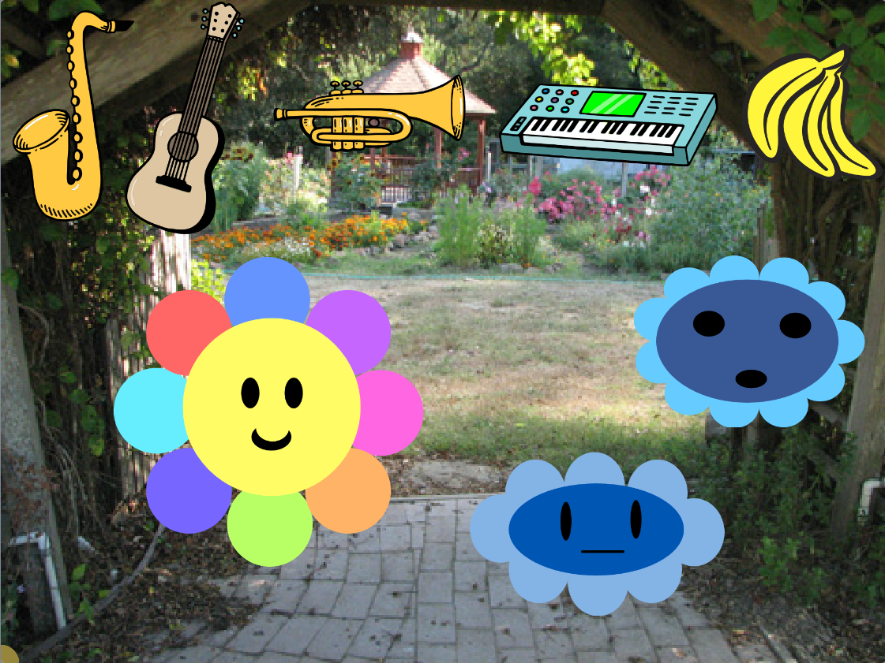

## Verander het geluid

<div style="display: flex; flex-wrap: wrap">
<div style="flex-basis: 200px; flex-grow: 1; margin-right: 15px;">
Voeg interactie toe zodat je kunt kiezen welk instrument wordt gebruikt wanneer een geluid wordt afgespeeld.
</div>
<div>
 <video width="320" height="240" controls>
  <source src="images/step-4-demo.mp4" type="video/mp4">
  Je browser ondersteunt geen mp4-video.
</video>
</div>
</div>

Het leuke aan digitale muziek is dat je één instrument-sprite kunt gebruiken om de geluiden van veel verschillende instrumenten eenvoudig af te spelen.

--- task ---

Voeg wat sprites toe om de verschillende geluiden weer te geven die je wilt dat je instrument speelt. Je kunt instrument sprites gebruiken, of kiezen wat je maar wilt, het hoeft niet logisch te zijn.



--- /task ---

Je kunt code toevoegen aan de **kies** sprite om het instrument te veranderen dat wordt gespeeld wanneer de **kies** sprite je extra sprites raakt.

--- task ---

Voeg code toe binnen een `herhaal`{:class='block3control'} blok, zodat wanneer de **kies** de verschillende sprites raakt, het instrument dat wordt gespeeld verandert. Bijvoorbeeld:

```blocks3
when flag clicked
forever
if <touching (Guitar v) ?> then
set instrument to (Electric Guitar v)
end
```
--- /task ---

Je kunt je project aanpassen zodat je elk geluid kunt afspelen wanneer de **kies** een instrument, voorwerp of personage op het speelveld raakt.

--- task ---

**Debug:** Mogelijk vind je enkele fouten in jouw project die je moet oplossen. Hier zijn enkele veelvoorkomende fouten.

--- collapse ---
---
title: Het geluid verandert in het verkeerde geluid
---

Zorg ervoor dat de `als`{:class="block3control"} voorwaarde in je `waarnemen`{:class='block3control'} blok overeenkomt met het gewenste instrument of geluid van de `muziek`{:class='block3custom'} extensie.

```blocks3
when flag clicked
forever
+ if <touching (Guitar v) ?> then
+ set instrument to (Electric Guitar v)
end
```

--- /collapse ---

--- /task ---
